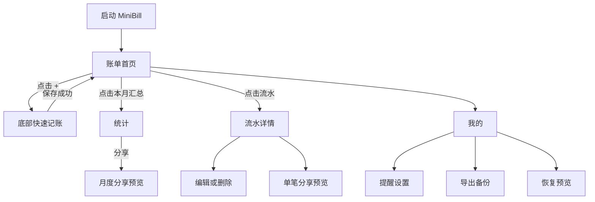
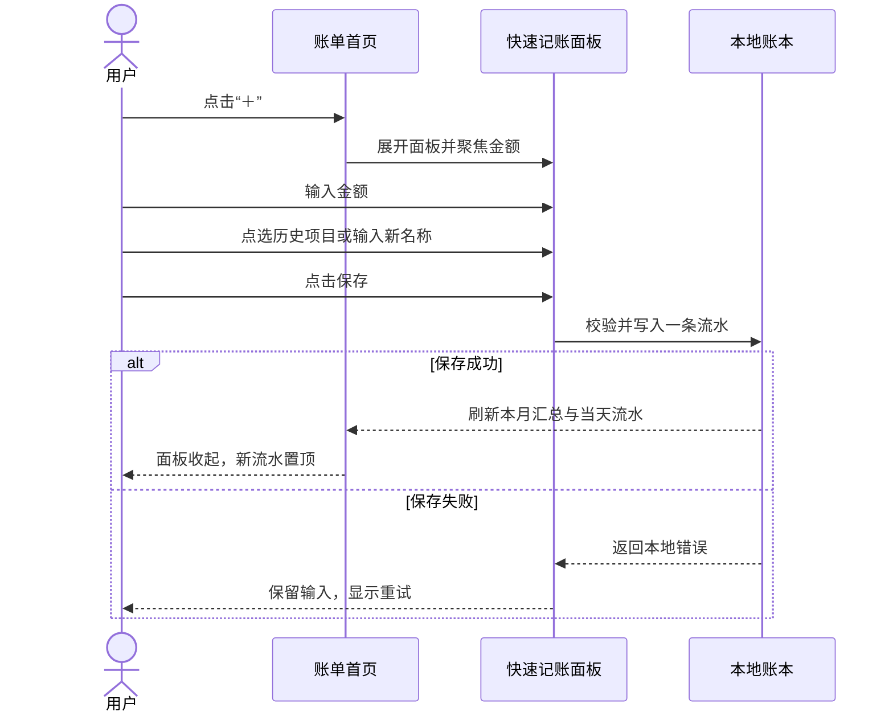
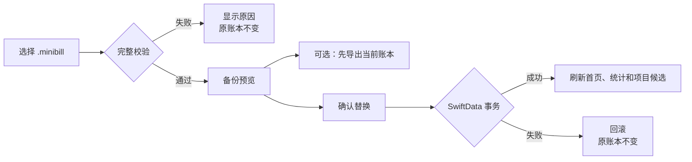

# MiniBill 原型与交互流程

## 1. 主导航

## 2. 三秒记账流程

核心规则：

- 打开面板后金额键盘立即可用。
- 最近项目不要求先进入输入框；点击候选即可选中。
- 用户从支出切回收入时，金额和项目名称保持不变。
- 保存期间按钮显示进行中并防止重复提交。
- 下滑关闭或点击遮罩时，如果已输入内容，需要确认放弃；空白面板可直接关闭。

## 3. 页面状态矩阵

| 页面 | 默认状态 | 空状态 | 错误状态 | 主要操作 |
|---|---|---|---|---|
| 账单首页 | 本月汇总 + 日期分组流水 | 无流水 + “记一笔” | 账本无法读取 | 记一笔 |
| 快速记账 | 收入、当前时间、最近项目 | 最近项目可为空 | 保留输入并重试 | 保存 |
| 流水详情 | 当前流水完整字段 | 不适用 | 保存失败 | 保存修改 |
| 统计 | 当月指标、趋势和排行 | 零值汇总 + 无排行 | 统计暂不可用 | 分享 |
| 月度分享 | 3:4 图片预览 | 零值月份仍可分享 | 生成失败后重试 | 系统分享 |
| 我的 | 本地记录数、设置项 | 0 笔同样显示 | 单项内联错误 | 进入设置项 |
| 恢复预览 | 备份与本机对比 | 空备份需强化警告 | 写入前拒绝 | 替换并恢复 |

## 4. 手势与反馈

- 流水行点击进入详情；左滑只提供“删除”，不提供多按钮菜单。
- 保存流水使用轻触觉反馈；删除和恢复使用警告反馈。
- 统计柱形图点击后进入当天流水，不在图表内放浮动工具栏。
- 加载本地数据不显示全屏转圈；超过 300 ms 才显示局部占位。
- 成功记账不弹模态成功框，仅用面板收起、列表插入和轻触觉反馈确认。

## 5. 通知跳转

| 通知 | 冷启动目标 | 已运行目标 |
|---|---|---|
| 每日记账提醒 | SwiftData 就绪后展开快速记账 | 当前页面上展开快速记账 |
| 月末结账提醒 | 当月统计 | 导航到当月统计 |

若 App 启动时本地账本无法打开，通知路由暂存；只有容器成功后才执行，避免落入空页面。

## 6. 备份恢复流程

MVP 不提供“合并”选项。该取舍避免重复识别、冲突优先级和部分成功状态。

## 7. 分享流程

1. 从统计页或流水详情点击分享。
2. 本地构建固定尺寸 SwiftUI 分享卡。
3. `ImageRenderer` 生成图片。
4. 展示预览；用户检查金额与日期。
5. 进入系统分享面板。

用户取消系统分享面板不显示错误，也不记录失败事件。

## 8. 原型文件

- `prototype/minibill-ui-prototype.html`：账单、记一笔、统计、分享和我的五个可切换状态。
- `prototype/minibill-design-board.html`：六个关键页面的静态画板。
- `assets/minibill-ui-design-board.png`：画板导出图。
